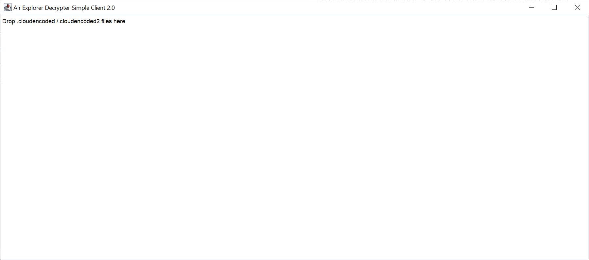
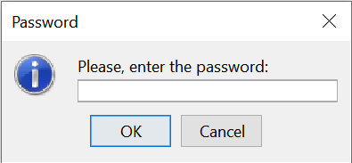
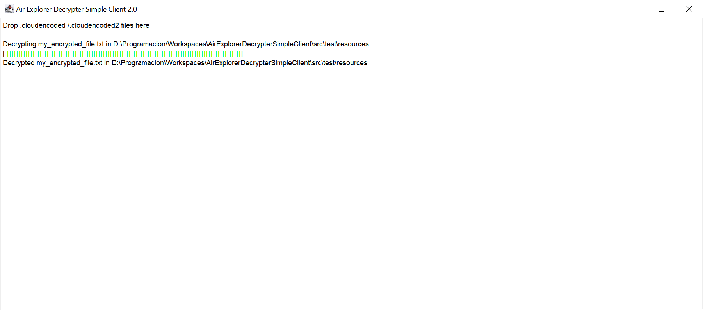
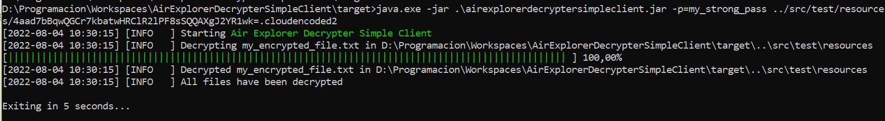

[](https://github.com/Proteus1989/Air-Explorer-Decrypter/blob/master/LICENSE)
[](https://github.com/Proteus1989/Air-Explorer-Decrypter-Simple-Client/releases/latest)
[](https://github.com/Proteus1989/Air-Explorer-Decrypter-Simple-Client/releases)

# Air Explorer Decrypter Simple Client

Java application able to decrypt Air Explorer encrypted files.

## Getting Started

### Prerequisites

Java 17+ is needed.

### Usage

To run the GUI client just execute the latest version of **AirExplorerDecrypterSimpleClient**.<br>
[Download the latest build](https://github.com/Proteus1989/Air-Explorer-Decrypter-Simple-Client/releases/latest)



After drag and drop one or more files into the window, the password dialog will appear.



And finally, the file(s) will be processed and decrypted



#### Command line

Display the help
```
java -jar AirExplorerDecrypterSimpleClient.jar -h
```
```
Usage: java -jar AirExplorerDecrypterSimpleClient.jar [-gh]
       [-o=<outputDirectory>] -p=<password> <file>...
Decrypts <file> to destination directory (encrypted file directory is chosen by
default).
      <file>...   one or more files to decrypt
  -g, --gui       display the graphical window
  -h, --help      display this help message
  -o, --output=<outputDirectory>
                  the destination folder
  -p, --password=<password>
                  the password
Copyright(c) 2022
```
**Mandatory fields:** the `password` and the `file path(s)`

##### Command line example
```
java -jar AirExplorerDecrypterSimpleClient.jar -p=test file1.cloudencoded file2.cloudencoded
```



To execute the same command but in the graphical window, just append the `-g` flag.
```
java -jar AirExplorerDecrypterSimpleClient.jar -g -p=test file1.cloudencoded file2.cloudencoded
```
## Authors

* **Antonio Suárez** - *Initial work and maintainer* - [Proteus1989](https://github.com/Proteus1989)

See also the list of [contributors](https://github.com/Proteus1989/Air-Explorer-Decrypter/contributors) who participated
in this project.

## License

This project is licensed under the MIT License - see the [LICENSE](LICENSE) file for details

## Acknowledgments

Thanks to **tomas-langer** for [**Chalk**](https://github.com/tomas-langer/chalk), a cross-platform standard output coloring.
